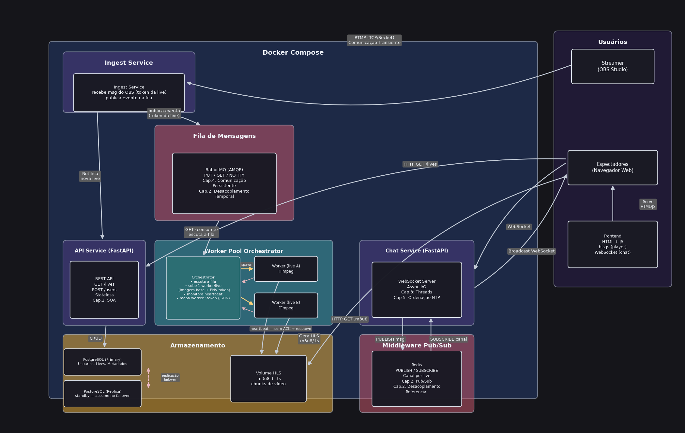

# Especificação do Projeto — Plataforma de Live Streaming Distribuída

> **Disciplina:** Sistemas Distribuídos — USP
> **Documento:** Especificação técnica + Questões levantadas em aula + Evolução da arquitetura
> **Como usar no Google Docs:** *Arquivo → Importar → Upload* deste `.md`, ou copie e cole o conteúdo (títulos e tabelas são preservados).

---

## 1. Visão Geral do Projeto

Plataforma de **transmissão de vídeo ao vivo (live streaming)** distribuída, no estilo Twitch/YouTube Live, construída sobre um conjunto de serviços desacoplados orquestrados via Docker Compose.

Um **streamer** transmite vídeo a partir do OBS Studio via RTMP. O sistema ingere esse fluxo, transcodifica para HLS sob demanda (um *worker* dedicado por live), e distribui o vídeo para múltiplos **espectadores** através de um player web. Em paralelo, cada live possui um **chat em tempo real** baseado em Pub/Sub.

### 1.1 Objetivos

- Permitir que múltiplas lives ocorram simultaneamente, cada uma isolada em seu próprio worker.
- Escalar horizontalmente a transcodificação (1 worker por live, criado dinamicamente).
- Garantir **tolerância a falhas**: workers e o orquestrador podem cair e o sistema se recupera sozinho.
- Manter os **dados críticos** (usuários, lives, doações/metadados) consistentes e replicados.
- Oferecer **chat em tempo real** com alta disponibilidade.

### 1.2 Escopo

| Dentro do escopo | Fora do escopo |
|---|---|
| Ingestão RTMP → HLS | Transcodificação multi-bitrate (ABR) |
| 1 worker por live (spawn dinâmico) | CDN geo-distribuída |
| Chat em tempo real via Redis Pub/Sub | Monetização / gateway de pagamento real |
| Replicação Primary/Réplica do banco | Autenticação federada (OAuth externo) |
| Healthcheck + auto-recuperação do orquestrador | Auto-scaling de nós físicos |

---

## 2. Arquitetura Final (componentes)

| Componente | Tecnologia | Responsabilidade | Estado |
|---|---|---|---|
| **Ingest Service** | nginx-rtmp | Recebe stream RTMP do OBS; publica evento `{token da live}` na fila | Stateless |
| **API Service** | FastAPI | REST: `GET /lives`, `POST /users`; persiste lives no Postgres | Stateless |
| **RabbitMQ** | AMQP | Fila de eventos "nova live" (desacoplamento temporal) | Stateful (durável) |
| **Worker Pool Orchestrator** | Python + Docker SDK | Consome a fila; sobe 1 worker/live; monitora heartbeat; respawn | Stateful efêmero (cache) |
| **Worker** | FFmpeg | Transcodifica RTMP → HLS (`.m3u8` + `.ts`) | Stateless (descartável) |
| **Health Monitor** | Python | Monitora o Orchestrator; redeploy + recuperação no crash | Stateless |
| **Chat Service** | FastAPI + WebSocket | Recebe e faz broadcast de mensagens; timestamp NTP | Stateful de sessão (socket) |
| **Redis** | Pub/Sub | Distribui mensagens do chat por canal/live | Stateful (mensagens em vôo) |
| **PostgreSQL Primary** | PostgreSQL | Fonte da verdade: usuários, lives, metadados | Stateful autoritativo |
| **PostgreSQL Réplica** | PostgreSQL | Standby; assume no failover | Stateful autoritativo |
| **Volume HLS** | Docker Volume | Buffer de chunks de vídeo entre worker e espectador | Stateful (durável) |
| **Frontend** | HTML + JS, hls.js | Player de vídeo + cliente WebSocket do chat (roda no cliente) | Stateless |

### 2.1 Diagrama da arquitetura



### 2.2 Diagramas de sequência (fluxos)

| Fluxo | Arquivo | Descrição |
|---|---|---|
| Fluxo 1 | `flow1.png` | Streamer inicia uma live (ingest → fila → orchestrator → worker → HLS) |
| Fluxo 2 | `flow2.png` | Espectador assiste a uma live (frontend → API/HLS → Postgres) |
| Fluxo 3 | `flow3.png` | Chat da live em tempo real (WebSocket ↔ Redis Pub/Sub) |
| Fluxo 4 | `flow4.png` | Teorema CAP aplicado: ramo CP (dados/$) vs ramo AP (chat) |
| Fluxo 5 | `flow5.png` | Recuperação do Orchestrator via Health Monitor (Cap.8 Fail-stop) |

---

## 3. Questões Levantadas em Aula

> Respostas fundamentadas na arquitetura final do projeto. Onde uma escolha é um *trade-off* assumido, isso é declarado explicitamente.

### Aula 1 — Modelos, Arquitetura Interna, Testes e Middleware

**Dos modelos estudados, algum se encaixa?**
Sim. O projeto combina três modelos:
- **Cliente-Servidor** em camadas (multitier): Frontend → API/Chat → Banco/Redis.
- **Baseado em eventos (event-based)**: Ingest publica eventos na fila; o Orchestrator reage — desacoplamento temporal e referencial.
- **Orientado a serviços (SOA)**: cada serviço (Ingest, API, Chat, Worker Pool) é independente, com responsabilidade única e implantável isoladamente.

O modelo predominante é o **orientado a eventos com estilo de microsserviços**, porque a criação de lives é inerentemente assíncrona e reativa.

**Arquitetura de software interna.**
Estilo de **microsserviços desacoplados** orquestrados por Docker Compose. Comunicação entre serviços via:
- HTTP/REST (API ↔ Frontend),
- AMQP/fila (Ingest → Orchestrator),
- Pub/Sub (Chat ↔ Redis),
- WebSocket (Frontend ↔ Chat).
A inteligência fica **stateless**; o estado é concentrado em 4 lugares: PostgreSQL, Redis, RabbitMQ e Volume HLS.

**Como o sistema será testado.**
- **Testes unitários** por serviço (lógica da API, parsing de eventos do Orchestrator).
- **Testes de integração** com `docker-compose` subindo o ambiente completo.
- **Teste de falha (chaos)**: derrubar manualmente um worker e o Orchestrator para validar o *respawn* e a recuperação via Health Monitor (Fluxo 5).
- **Teste de carga**: múltiplas lives simultâneas + múltiplos espectadores no chat.
- **Teste end-to-end**: OBS publica → espectador recebe HLS < N segundos de latência.

**Faz sentido usar algum middleware?**
Sim, dois middlewares centrais:
- **RabbitMQ** (message broker) — desacopla a ingestão da orquestração (Cap.4: comunicação persistente).
- **Redis Pub/Sub** — distribui mensagens de chat em tempo real (Cap.2: desacoplamento referencial).
Ambos são essenciais: sem eles, os serviços ficariam fortemente acoplados e síncronos.

**Diagrama da arquitetura.** Ver seção 2.1 (`general_architecture.png`).

---

### Aula 2 — Comunicação

**Qual tipo de comunicação será usada? (Sync ou Async)**
Ambos, conforme o caso:
- **Assíncrona**: Ingest → RabbitMQ → Orchestrator (eventos), e Chat ↔ Redis (Pub/Sub).
- **Síncrona**: Frontend → API REST (`GET /lives`), e download de chunks HLS via HTTP.
- **Streaming contínuo**: RTMP (OBS → Ingest) e WebSocket (chat bidirecional).

**TCP ou UDP ou outro?**
**TCP** em toda a stack, pois a integridade importa mais que latência mínima:
- RTMP sobre TCP (ingestão),
- HTTP/HLS sobre TCP (distribuição de vídeo),
- AMQP sobre TCP (fila),
- WebSocket sobre TCP (chat).
UDP foi descartado: perda de chunks de vídeo ou de mensagens de chat é inaceitável para a experiência.

**Conexões temporárias ou duradouras?**
- **Duradouras**: RTMP (enquanto a live durar), WebSocket (enquanto o espectador estiver no chat), conexões do worker com a fila.
- **Temporárias**: chamadas REST e cada `GET` de chunk HLS (request/response curto — Cap.4: comunicação transiente).

**Quais são os tipos de mensagens e seus formatos?**

| Mensagem | Origem → Destino | Formato |
|---|---|---|
| `live.started { token }` | Ingest → RabbitMQ | JSON |
| `POST /lives`, `POST /users` | Frontend/Ingest → API | JSON (HTTP body) |
| Chunks de vídeo | Worker → Volume HLS → Frontend | Binário `.ts` + playlist `.m3u8` |
| `chat:live_X { user, msg, ts }` | Chat → Redis → Chat | JSON |
| Heartbeat | Worker ↔ Orchestrator ↔ Health Monitor | Ping/ACK (curto) |

**Definição de diagramas de sequência.** Ver seção 2.2 (Fluxos 1–5).

---

### Aula 3 — Nomeação e Processos

**Quais recursos precisam ser nomeados/identificados?**
- **Live** → `token` único (gerado na ingestão, usado como chave em toda a stack).
- **Worker** → `worker_id` (container Docker).
- **Canal de chat** → `chat:live_<token>` (chave Redis).
- **Stream HLS** → caminho `/streams/live_<token>/index.m3u8`.
- **Usuário** → `user_id` (PK no Postgres).

**Qual é o esquema de nomeação? (Plano, estruturado ou por atributos)**
**Estruturado / hierárquico**: os nomes seguem caminhos (`/streams/live_123/chunk_001.ts`, `chat:live_123`). É legível, compõe naturalmente e mapeia direto para URLs HTTP e chaves Redis.

**Dado o esquema, qual mecanismo de resolução de nomes?**
- **DNS interno do Docker Compose** resolve nomes de serviço (`api`, `redis`, `rabbitmq`) para IPs do container.
- O `token` da live resolve para o **worker** via mapa do Orchestrator (cache) e, de forma autoritativa, via **`SELECT ... WHERE status='active'`** no Postgres.
- O caminho HLS resolve para arquivos no Volume compartilhado.

**Processos — Faz sentido usar threads?**
Sim:
- **Chat Service**: Async I/O / threads para lidar com muitas conexões WebSocket simultâneas (Cap.3).
- **Workers FFmpeg**: processos CPU-bound, isolados em containers (paralelismo por processo, não por thread).
- **API**: workers do FastAPI/Uvicorn atendem requests concorrentes.

**Servidores: Stateful ou stateless?**

| Stateless | Stateful efêmero | Stateful autoritativo |
|---|---|---|
| Frontend, API, Ingest, Workers, Health Monitor | Worker Pool Orchestrator (cache), Chat (socket) | Postgres Primary+Réplica, RabbitMQ, Redis, Volume HLS |

A decisão de projeto é manter **toda a lógica stateless** e isolar o estado nos 4 backends de dados — o que habilita escala horizontal e recuperação simples.

**Faz sentido usar técnicas de virtualização?**
Sim, é o **alicerce** do projeto: **containers Docker**. Cada serviço roda isolado, e a virtualização leve viabiliza o padrão central — o Orchestrator **cria um container worker por live** a partir de uma **imagem base + ENV token**. Sem virtualização/containers, o isolamento por live e o spawn dinâmico não seriam práticos.

---

### Aula 4 — Replicação e Consistência

**Haverá replicação no projeto?**
Sim, em dois níveis:
- **PostgreSQL Primary + Réplica** (dados).
- **Redis** distribuindo mensagens entre instâncias do chat.
- O **Volume HLS** também funciona como cópia materializada do vídeo (replicação de conteúdo).

**Se não, quais as consequências?** (N/A — há replicação.)
Caso não houvesse réplica do banco: um único PostgreSQL seria **ponto único de falha** — sua queda derrubaria login, listagem de lives e o registro de lives ativas (impossibilitando a recuperação do Orchestrator descrita no Fluxo 5).

**Se sim:**

- **Quais dados da entidade serão replicados?**
  Tabelas de **usuários, lives (com `status`, `worker_id`), metadados e doações/$**. As mensagens de chat são replicadas de forma efêmera via Redis.

- **Qual modelo de consistência adotado?**
  - **Consistência forte** para dados financeiros e de lives no Postgres (CP).
  - **Consistência eventual** (Cap.7) para o chat via Redis (AP).

- **Como distribuir as cópias? Estática ou dinâmica?**
  - **Estática** para o Postgres: topologia Primary→Réplica fixa, definida no Compose.
  - **Dinâmica** para o conteúdo HLS: chunks são gerados e disponibilizados sob demanda conforme novas lives sobem.

- **Qual protocolo de consistência?**
  Replicação **Primary/Réplica** do PostgreSQL (WAL shipping / streaming replication) com **failover**: se o Primary cai, a Réplica é promovida.

- **Implementar ou usar uma distribuída (pronta)?**
  **Usar solução pronta**: replicação nativa do PostgreSQL e Pub/Sub do Redis. Implementar um protocolo de consistência do zero (Raft/Paxos) seria fora de escopo e propenso a erro — reusar soluções maduras é a decisão correta.

---

### Aula 5 — Tolerância a Falhas

**Para seu projeto, é mais importante disponibilidade ou confiabilidade?**
**Depende do subsistema** — esta é a aplicação prática do Teorema CAP (Fluxo 4):
- **Dados / $ (Postgres):** prioriza **confiabilidade/consistência** (CP). Melhor recusar uma transação do que duplicar dinheiro.
- **Chat (Redis):** prioriza **disponibilidade** (AP). O chat deve continuar funcionando mesmo sob partição, aceitando atraso eventual de mensagens.

**Quais tipos de falha deseja-se tolerar? (crash, omissão, temporal, resposta, bizantino)**
- **Crash** (principal): queda de worker, do Orchestrator ou de um nó — tratado via heartbeat + respawn + redeploy.
- **Omissão**: mensagem perdida — mitigada por filas persistentes (RabbitMQ) e ACK.
- **Temporal** (parcial): atrasos no chat são tolerados (consistência eventual).
- **Resposta / Bizantino**: **fora de escopo** — assume-se modelo **fail-stop** (Cap.8), não bizantino. Não há nós maliciosos no modelo de ameaça.

**Quantos processos falhantes serão suportados?**
- Qualquer número de **workers** pode falhar — cada um é independente e recriável (1 falha não afeta outras lives).
- **1 falha do Orchestrator** é tolerada e recuperada automaticamente pelo Health Monitor.
- **1 falha do Postgres Primary** é tolerada via promoção da Réplica.

**Quais as estratégias para detectar falhas?**
- **Heartbeat** worker → Orchestrator (sem ACK ⇒ respawn).
- **Heartbeat/ping** Health Monitor → Orchestrator (timeout ⇒ redeploy).
- **Healthcheck** do Docker e replicação do Postgres detectando indisponibilidade do Primary.

**Qual protocolo utilizar?**
Modelo **fail-stop** com detecção por **timeout de heartbeat**. A recuperação reidrata o estado a partir da **fonte da verdade** (Postgres), não de estado em memória.

**Quais as consequências do Teorema CAP para o projeto?**
O sistema é **particionado por intenção** em dois regimes (Fluxo 4):
- **CP** para dados/$ — sob partição, sacrifica disponibilidade (recusa a operação) para nunca violar consistência.
- **AP** para chat — sob partição, sacrifica consistência imediata para manter o chat no ar (consistência eventual).
Não existe "C+A+P" simultâneo; a arquitetura escolhe conscientemente o lado em cada subsistema.

**Como recuperar da falha?** (Fluxo 5)
1. Health Monitor detecta timeout do Orchestrator.
2. Faz **redeploy** do Orchestrator a partir da **imagem base** (sem estado em memória).
3. Lê do **Postgres** as lives com `status='active'` (somente as ativas).
4. **Re-publica** os eventos correspondentes no RabbitMQ.
5. O novo Orchestrator consome a fila e **recria os workers** (imagem base + ENV token), atualizando o Postgres.
6. O **Volume HLS** persistiu durante a queda, então os espectadores praticamente não percebem a interrupção.

**Tudo bem as respostas serem "não OK"?**
Sim. Algumas decisões são *trade-offs* assumidos e declarados como tais:
- **Não toleramos falhas bizantinas** — assumido fail-stop (custo/benefício não justifica BFT para este domínio).
- **Chat aceita perda/atraso eventual de mensagens** — escolha AP consciente.
- **Réplica do Postgres tolera 1 falha**, não falhas em cascata simultâneas.
Documentar uma limitação como decisão racional é preferível a fingir robustez que não existe.

---

## 4. Evolução do Trabalho — Linha do Tempo da Arquitetura

A arquitetura **não nasceu pronta**: ela evoluiu à medida que as perguntas de cada aula expuseram fragilidades no desenho inicial. Abaixo, a linha do tempo ligando **cada reflexão de aula** à **mudança de componente** que ela provocou.

> Comparação visual: `old_architecture.png` (inicial) → `general_architecture.png` (final).

### Linha do tempo

```text
[v1 — Inicial]                          [v2 — Intermediária]                 [v3 — Final]
Worker Pool estático (Worker 1/2) ──►   Orchestrator + spawn dinâmico  ──►   + Health Monitor (auto-recuperação)
"PUT tarefa transcodificação"           "publica evento (token)"             Orchestrator persiste live no Postgres
PostgreSQL único                        PostgreSQL Primary + Réplica         Réplica com failover validado
Frontend ligado à área do OBS           Frontend movido p/ Usuários          Frontend serve HTML/JS aos Espectadores
```

### 4.1 De Worker Pool estático → Worker Pool Orchestrator (spawn dinâmico)

**Pergunta que disparou a mudança (Aula 3 — Processos / Virtualização):**
*"Faz sentido usar técnicas de virtualização?"* e *"Servidores stateful ou stateless?"*

**Reflexão:** na v1, havia "Worker 1" e "Worker 2" fixos consumindo da fila de forma genérica (modelo *competing consumers* com tarefas de transcodificação). Isso não modelava bem a realidade: **cada live precisa de um processo dedicado e isolado**, e o número de lives é dinâmico. Manter workers fixos significava ou desperdício (ociosos) ou gargalo (lives demais para poucos workers).

**Mudança:** introduzimos o **Orchestrator**, que usa **virtualização (Docker)** para **criar 1 worker por live sob demanda** a partir de uma imagem base + ENV token. O worker passou a ser **stateless e descartável**.

**Consequência:** isolamento por live, escala horizontal natural, e workers que podem morrer sem afetar outras lives.

### 4.2 De "PUT tarefa de transcodificação" → "publica evento (token da live)"

**Pergunta que disparou a mudança (Aula 2 — Comunicação / Aula 1 — Middleware):**
*"Qual tipo de comunicação? Sync ou Async?"* e *"Faz sentido usar middleware?"*

**Reflexão:** na v1, o Ingest enviava uma "tarefa de transcodificação" para a fila — uma visão **orientada a tarefa/RPC**. Ao analisar o desacoplamento temporal (Cap.2/4), percebemos que o correto é o Ingest **publicar um evento de domínio** ("nasceu uma live, eis o token") e deixar o Orchestrator decidir o que fazer. Isso é genuinamente **assíncrono e orientado a eventos**.

**Mudança:** a fila passou de transporte de tarefas para **barramento de eventos**; a semântica virou `live.started { token }`.

**Consequência:** desacoplamento real — o Ingest não sabe nem se importa quem consome o evento.

### 4.3 De PostgreSQL único → Primary + Réplica com failover

**Pergunta que disparou a mudança (Aula 4 — Replicação / Aula 5 — Tolerância a falhas):**
*"Haverá replicação? Se não, quais as consequências?"* e *"É mais importante disponibilidade ou confiabilidade?"*

**Reflexão:** a v1 tinha **um único PostgreSQL** — um ponto único de falha clássico. Discutindo CAP e confiabilidade dos dados financeiros, concluímos que **dados/$ exigem o lado CP** e que perder o banco era inaceitável (derruba login, lives e, criticamente, o registro de quais lives estão ativas).

**Mudança:** adicionamos a **Réplica** com replicação e **failover** (promoção automática).

**Consequência:** tolerância a 1 falha do banco e a base para a recuperação do Orchestrator (a Réplica garante que a "fonte da verdade" sobrevive).

### 4.4 Surgimento do Health Monitor (auto-recuperação do Orchestrator)

**Pergunta que disparou a mudança (Aula 5 — Tolerância a falhas / Como recuperar):**
*"Quantos processos falhantes serão suportados?"*, *"Como detectar falhas?"* e *"Como recuperar da falha?"*

**Reflexão (a mais importante):** ao classificar o Orchestrator como **stateful** (ele guarda em memória o mapa `worker→token`), percebemos um problema sério: **se o Orchestrator cair, quem o recria? E como ele redescobre as lives ativas?** Inicialmente cogitamos reconstruir o estado lendo o RabbitMQ — mas isso estava **conceitualmente errado**: uma fila não é banco; após o ACK a mensagem some, então não dá para "consultar lives ativas" nela.

**Mudança em duas partes:**
1. O **Orchestrator passou a persistir cada live ativa no Postgres** (`UPDATE live SET worker_id, spawned_at`). Assim o mapa em memória vira apenas **cache**; a verdade fica no banco.
2. Criamos o **Health Monitor**, que monitora o Orchestrator via heartbeat e, no crash: faz **redeploy** da imagem base → lê **somente as lives ativas** do Postgres → **re-publica** os eventos no RabbitMQ → o novo Orchestrator reidrata os workers.

**Consequência:** o Orchestrator deixou de ser um ponto único de falha não-recuperável. O sistema passou a ter **recuperação automática fim-a-fim** (Fluxo 5), respeitando o modelo fail-stop (Cap.8). Esta foi a evolução que mais amadureceu o projeto, e nasceu diretamente da reflexão sobre *estado* (Aula 3) cruzada com *recuperação de falhas* (Aula 5).

### 4.5 Reposicionamento do Frontend

**Pergunta que disparou a mudança (Aula 1 — Arquitetura interna / Aula 2 — Comunicação):**
*"Arquitetura de software interna"* e *"Conexões temporárias ou duradouras?"*

**Reflexão:** na v1, o Frontend aparecia ligado à área do OBS/ingestão, sugerindo (incorretamente) uma relação com o streamer. Na verdade, **o Frontend roda no cliente (espectador)**: serve HTML/JS estático e consome HLS + WebSocket. Ele não tem conexão alguma com o OBS.

**Mudança:** o Frontend foi movido para dentro do bloco **Usuários**, conectado aos **Espectadores** ("Serve HTML/JS"), separando claramente o plano de **ingestão** do plano de **consumo**.

**Consequência:** o diagrama passou a refletir corretamente as fronteiras de rede e a natureza cliente-lado do player.

### 4.6 Síntese da evolução

| Aspecto | v1 (antiga) | v3 (final) | Aula que motivou |
|---|---|---|---|
| Workers | Estáticos (1, 2) | Spawn dinâmico por live | Aula 3 (processos/virtualização) |
| Fila | Tarefa de transcodificação | Evento `live.started` | Aula 1 e 2 (middleware/async) |
| Banco | Único | Primary + Réplica + failover | Aula 4 e 5 (replicação/confiabilidade) |
| Recuperação do Orchestrator | Inexistente | Health Monitor + estado no Postgres | Aula 5 (tolerância a falhas) |
| Estado do Orchestrator | Implícito em memória | Cache + fonte da verdade no Postgres | Aula 3 + Aula 5 |
| Frontend | Ligado ao OBS | Lado do cliente (Espectadores) | Aula 1 e 2 (arquitetura/comunicação) |

---

## 5. Conclusão

A arquitetura final é o resultado direto do **questionamento sistemático** proposto em cada aula. Os pontos de maior amadurecimento — spawn dinâmico de workers, replicação do banco e, sobretudo, o **Health Monitor com reidratação a partir do Postgres** — não foram decisões iniciais, mas respostas a fragilidades reveladas ao confrontar o desenho com perguntas sobre **comunicação, nomeação, estado, replicação e tolerância a falhas**. O projeto demonstra, na prática, como conceitos de Sistemas Distribuídos (desacoplamento, CAP, fail-stop, consistência eventual, virtualização) se traduzem em decisões concretas de arquitetura.
